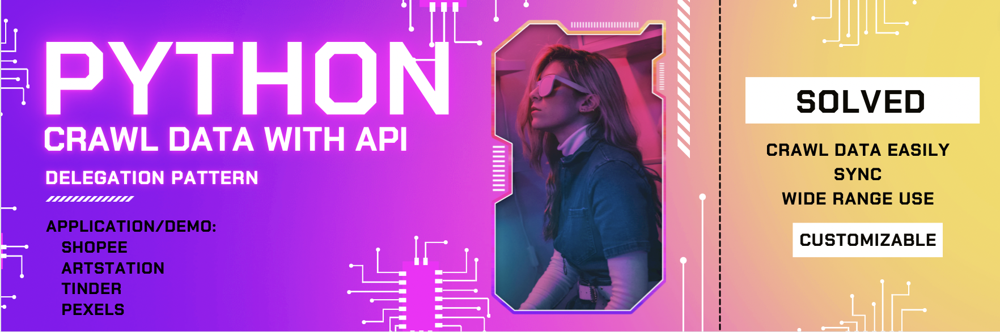

   
    
   

> An effective way is widely used in the mobile development sector to build APIService, which I now bring to the data-related sector.

# Delegation Pattern In Python To Crawl Data With API

- [Delegation Pattern In Python To Crawl Data With API](#delegation-pattern-in-python-to-crawl-data-with-api)
  - [The problem it solved](#the-problem-it-solved)
  - [Why these demos](#why-these-demos)
  - [Knowledge Base](#knowledge-base)
    - [Catch that API call](#catch-that-api-call)
    - [Delegation Pattern](#delegation-pattern)
  - [Structure](#structure)
  - [Application](#application)
    - [Shopee](#shopee)
    - [Artstation](#artstation)
    - [Tinder](#tinder)
    - [Pexels](#pexels)

## The problem it solved

- Crawl data easily
- Sync
- Code be clear
- Collect any possible data you want, even Tinder! (check robots.txt, the license page,... to make sure you are not violent with any rules)
- Wide range use

## Why these demos

- Artstation & Pexels: Useful on computer vision tasks
- Shopee: See [this repo](https://github.com/comphilano/ds_final/)
- Tinder: Know yourself better, see [more](#tinder)

## Knowledge Base

### Catch that API call

:warning: Make sure you check robots.txt, the license page,... to not be violent with any rules.

The demonstration is from [this repo](https://github.com/comphilano/ds_final/blob/main/Slide.pdf) (Crawl data section).

Here I demonstrate how to catch Shopee API, you could use the same technique for every other site:

 
 
 
 
 
 
 
 

 

### Delegation Pattern

After we know how to make an API request to Shopee (or Artstation, 🔥Tinder,...), we could build the class named `APIService` to make the request. We want the class automatically handle the data after it has been received from the request, even success or not. The problem is where we handle the data and where we make the request should not be in the same class, and the same file. The Delegation pattern is the answer! It helps the code be clear. So the pipeline is:

Request (`APIService`) ---Success--> Handle (`DataCrawler.updateDataWhenSuccess()`) -> Request (`APIService`)

Request (`APIService`) ---Error--> Handle (`DataCrawler.getDataError()`)

## Structure

- APIService
- ItemModel
- GetData

## Application

:warning: **You should change the request headers (`self.headers`) on file `APIService.ipynb` to match yours.**

### Shopee

 :loudspeaker: **Up-to-date: 07/10/2022**

 [How to use the crawler](https://github.com/comphilano/ds_final#crawler)

Go to the Shopee [folder](application/shopee).

### Artstation

Go to the Artstation [folder](application/artstation).

:bulb: TODO: This is the code from November 2021, now October 2022, for some reason, looks like it crawls all the data available with `per_page = 3, max_page=1`, so:

- Check the API call
- If you decide to use this code, make sure to check attribute `all_items` to not have any duplicate value, and limit it, because calling the method `crawlImage()` will take time.

### Tinder

There are some scenarios you need the Tinder crawl tool. Mostly while you have thousands of matches on Tinder. A possible scenario is you would want to see more insight about yourself that you may not know before, such as which traits of people will attract you most.

I will publish the code later 🤔

### Pexels

Go to the Pexels [folder](application/Pexels).

Not done yet! Now it works on a JSON file you already downloaded, use the function on `GetData`, need to change the APIService.
